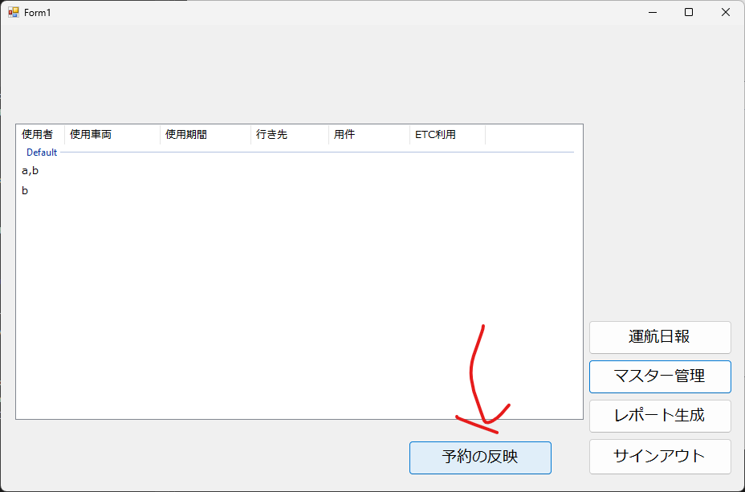

# モックアップについて

本プロジェクトではモックアップを作成することでUIに対し、認識をすり合わせることを目的としています。
また、開発期間が2週程度しかないため、工数をかからない、Windows Formsで開発できたらと考えています。

## Windows Formsのセットアップについて

Windows FormsはVisual Studio Communityを使用し作ることができます。

1. [Microsoftの公式サイトへアクセスし](https://visualstudio.microsoft.com/ja/downloads/)画像の通り、コミュニティ版をダウンロードし、実行します。


2. インストーラーを起動し、続行をクリックします


3. すでにインストール済みの方は、変更をクリックし、


4. **.Net デスクトップ開発**にチェックボックスを入れ、**ダウンロードしながらインストールする**をクリックします。


5. インストールが完了したらリポジトリをGithubからクローンします。[Github](https://github.com/R6-B2-SDPL2/car_management_system)にアクセスし、クローンするためのURLをコピーします。
おそらくLinux環境では、HTTPS経由のクローンはGithubがアクセストークンの廃止の影響のあおりを受け、失敗する可能性があります。Linuxでクローンする場合は[SSHを使用したGithubへの接続](https://docs.github.com/ja/authentication/connecting-to-github-with-ssh)を参考にするか[アクセストークンを作ってください](https://docs.github.com/ja/authentication/keeping-your-account-and-data-secure/managing-your-personal-access-tokens)


6. 本ドキュメントでは、コマンドライン経由でリポジトリの準備します。
7. 本プロジェクトのモックアップですが、現在メインブランチにマージされておらず、[プルリクエスト](https://github.com/R6-B2-SDPL2/car_management_system/pull/1)として、ブランチをのマージをリクエスト中です。従いまして、プルリクエストからローカルリポジトリにfetchを行う必要があります。

```shell
git fetch origin pull/1/head:mockup
```

まずは上記コマンドを入力します。このコマンドは、リモートリポジトリからfetchするコマンドで、第三引数では、pull/プルリクエストID/head:ブランチ名でfetchします。

8. フェッチしたら、checkoutし、mockupブランチに変えます


9. mockupブランチになったら、

```shell
./mockup/mockup.sln
```

を起動します。


10. Visual Studioが起動されます。起動したら、まずは動作確認として**CTRL+F5**でビルド実行します


11. 動作が確認出来たら、実際にボタンを配置していきたいと思います。ツールボックスを起動し、ツールボックスから、適当なボタンを選びます。画像ではボタンを選び適当な位置に配置します。なおボタンについては右下のプロパティから適当にパラメータを調整することができます。


12. 配置したコントロールは右下のプロパティから変更でき、画像ではボタンに表示されているテキストを変更し**予約の反映**と変更しています。


13. 以上の変更をし実行すると反映されていることが確認できると思います


